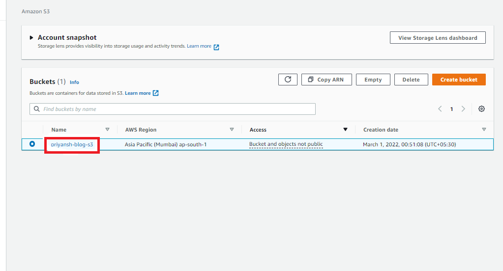

# Host Static Website Using AWS S3

AWS Simple Storage Service (S3) from the aforementioned list, S3, is the object storage service provided by AWS. It is probably the most commonly used, go-to storage service for AWS users given the features like extremely high availability, security, and simple connection to other AWS Services. 

An Amazon S3 bucket can be set up to operate similarly to a website. This section illustrates how to host a website using Amazon S3. There are mainly 7 steps to hosting a static website using Amazon Web Service(AWS) S3.

**1. Creating a Bucket**

- First, we have to launch our S3 instance. Follow these steps for creating a Bucket

 - Open the Amazon S3 console by logging into the AWS Management Console at https://console.aws.amazon.com/s3/.
 Click on `Create Bucket`.

 

 - Choose `Bucket Name` – Bucket Name Should be Unique
 - `AWS Region` –  Choose a region close to you or the region where you want to create the bucket (Example — Mumbai)
 - `Object Ownership` – Enable for making Public, Otherwise disable

**2. Block Public Access settings for the bucket**

- Uncheck (Block all public access) for the public, otherwise set default. If we uncheck (Block all public keys).

- `Bucket Versioning`:- We have to do Nothing (Disable)
- `Tags(0)` : Optional
- `Default encryption`: Disable

- Now, click on `Create Bucket`

**3. Now upload code files**

- `Select Bucket` and Click your `Bucket Name`.

- Now, click on upload (then click add File/folder) and select our `HTML code` file from our PC/Laptop.

- After uploading, click on `Close`.

**4. Once the Files are uploaded successfully, click on `Permissions` and now follow this Process –**

- `Block public access`:
      - Click on `Edit`, under `Bucket Policy`.
      - `Uncheck Block` all public access.
      - `Save changes` then type “`confirm`”.

- `Object Ownership`: 
    - Click on `Edit`.
    - Click on `ACLs Enabled`.
    - `Check` I acknowledge ….. restored.
    - Choose `Save Changes`.

**5. Make public Object**
      - Now, Click on `Objects`.
      - Select our `All Objects`.
      - Now, Click on `Actions`.
      - Select `Make Public Using ACL`.
      - Now, Click on `Make Public` and `Close`.

**6. Copy our Object URL**
- Now, click on our `HTML File` Object Name.
- Copy the `Object URL`.

**7. Check out our Website**

- Directly Paste this URL into the Other Tab or our other System.
- Now our Website is available in the Public.
- We Successfully Host our `Website by AWS S3.to`